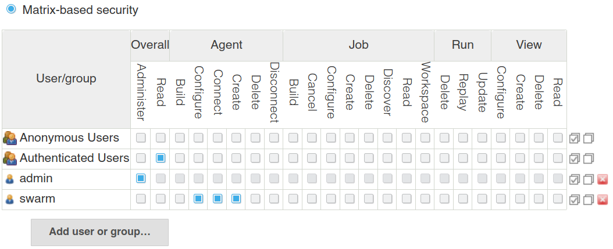
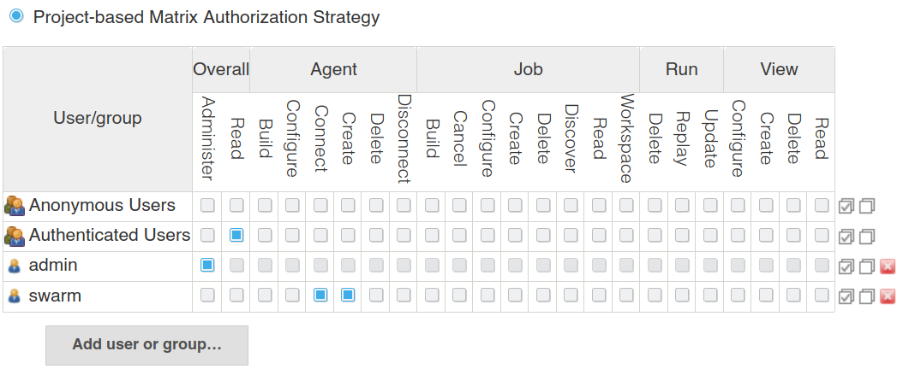
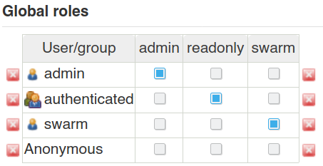

= Global Security Configuration
:toc:
:toc-title:
ifdef::env-github[]
:tip-caption: :bulb:
:note-caption: :information_source:
:important-caption: :heavy_exclamation_mark:
:caution-caption: :fire:
:warning-caption: :warning:
endif::[]

== Overview

=== Authentication

Swarm may be used with either a https://www.jenkins.io/blog/2018/07/02/new-api-token-system/[Jenkins API token] (recommended) or a password.
The following command-line options control authentication:

`-username`:: The Jenkins username for authentication.
`-password`:: The Jenkins user API token or password.
`-passwordEnvVariable`:: Environment variable containing the Jenkins user API token or password.
`-passwordFile`:: File containing the Jenkins user API token or password.

NOTE: When using a password, the Swarm client will automatically obtain a valid https://support.cloudbees.com/hc/en-us/articles/219257077-CSRF-Protection-Explained[CSRF crumb] when making requests.

=== Authorization

Swarm requires a user with the following permissions:

* *Overall/Read*
* *Agent/Create*
* *Agent/Connect*
* *Agent/Configure* (_not_ required when using the project-based Matrix Authorization Strategy)

== Examples

=== Matrix-based security

A common practice is to grant *Overall/Read* permission to either anonymous or authenticated users, leaving the dedicated Swarm user with only *Agent/Create*, *Agent/Connect*, and *Agent/Configure* permissions:

=== Project-based Matrix Authorization Strategy

A common practice is to grant *Overall/Read* permission to either anonymous or authenticated users, leaving the dedicated Swarm user with only *Agent/Create* and *Agent/Connect* permissions:

NOTE: Unlike matrix-based security, the project-based Matrix Authorization Strategy does not require *Agent/Configure* permission.

=== Role-Based Strategy

A common practice is to create a read-only role with *Overall/Read* permission, leaving a dedicated Swarm role with only *Agent/Create*, *Agent/Connect*, and *Agent/Configure* permissions:

image:images/roleBasedStrategyManage.png[image]

The read-only role can then be assigned to either anonymous or authenticated users, leaving the dedicated Swarm role for Swarm users only:

== Caveats and Troubleshooting

A single Jenkins controller currently supports a single selection from a multitude of possible authentication providers.
If your Jenkins deployment outgrows locally-defined accounts and switches to an external database, such as LDAP, GitHub or Google authentication, you would have to define there not only team member accounts, but also some for your Swarm agents to use.

=== GitHub Authentication plugin

With "Github Authentication Plugin" selected as the active Security Realm implementation for a Jenkins controller, it is no longer possible to authenticate the Swarm client with an account defined only locally on the Jenkins controller with a password (since the local database was no longer selected to be used for authentication), although this account is otherwise known and manageable in Jenkins UI.

As tracked in https://issues.jenkins.io/browse/JENKINS-63421[issue JENKINS-63421] currently the "GitHub Committer Authorization Strategy" delivered as an optional part of the https://plugins.jenkins.io/github-oauth/[GitHub Authentication plugin] (`github-oauth-plugin`) lacks a way to assign *Agent/...* permissions.
Due to this, you would have to define a Matrix-based or Project-based Matrix strategy as detailed above, and use the account (and group/organization) names provided and confirmed by its Authentication part as your enabled Security Realm.
Note this can forfeit some benefits compared to native strategy provided by the plugin: it is questionable whether the matrix setup can go into such detail as `github-oauth-plugin` natively can -- e.g. considering PR authors, collaborators, contributors... as special groups).

==== Primary setup

Swarm clients can connect to the Jenkins controller using a GitHub account, and passing the token string with one of the `-password*` CLI options for the Swarm agent JAR startup.

On the Jenkins controller side, the active authorization strategy has to be switched from "GitHub Committer Authorization Strategy" to a manually made somewhat equivalent Matrix. 
It would be statically listing names of your project's GitHub organizations and teams of admin and other accounts as groups with specific rights.
Be sure to not lock yourself out in the process -- perhaps adding an entry for your GitHub user name explicitly, assigning all privileges to it, and applying the change as the first step.
Finally, make that the name of GitHub account prepared for Swarm connections is granted the permissions needed for Swarm client, as detailed above.

On the GitHub side, it suffices to generate a token with minimal permission set needed for authentication, per requirements of the GitHub Authentication plugin -- currently one needs to have the `read:user` and `read:org` permissions (and possibly `user:email`).

NOTE: Authentication to the GitHub API directly by password no longer works since 2020, only by tokens.
On an upside, this allows to issue (and revoke) many tokens for many build agents using the same GitHub account, and to limit the impact of a breach using a minimally privileged token.

==== Recommendations about tokens

For easier management and revokation of tokens, take time to comment the token in the optional Note field (e.g. which team member or pre-built image is it delegated to, and when) while you are generating it.

This is particularly important if tokens are later used on machines not managed by the Jenkins build farm administrators, e.g. team members or project users contributing resources to help a project.

If you distribute pre-built images for containers or virtual machines that can be used as workers for your project, it is reasonable to ensure that recent and secure software is used on systems connecting to your Jenkins controller, by pre-installing different tokens over time and phasing out access for old ones -- as those images eventually become insecure.

==== Recommendations about membership

It is recommended to keep the GitHub account for authenticating Swarm connections outside your project's GitHub organization for several reasons:

* so it has no rights there assigned by accident or abused by a security breach;
* even (or especially) if your organizations or projects are private, *this* account does not need to access them for its work -- it only needs to exist and successfully authenticate with GitHub API;
* the Matrix-based security configuration with GitHub Authentication plugin supports user names as Jenkins accounts, and organization names and `org*team` notation as Jenkins groups; while it is reasonable to allow any members of the specified organization various permissions for the Jenkins jobs and other objects, an account used purely for agent connections does not need those (and should not inherit them by being an org member).

==== Further notes

Even if the worker machine is isolated by firewall, so that it can not access the Internet generally and can only talk to the Jenkins controller (using both HTTP/HTTPS and the "TCP port for inbound agents"), the GitHub authentication still works -- since it is not the Swarm client that has to go to GitHub and back to confirm the account.
